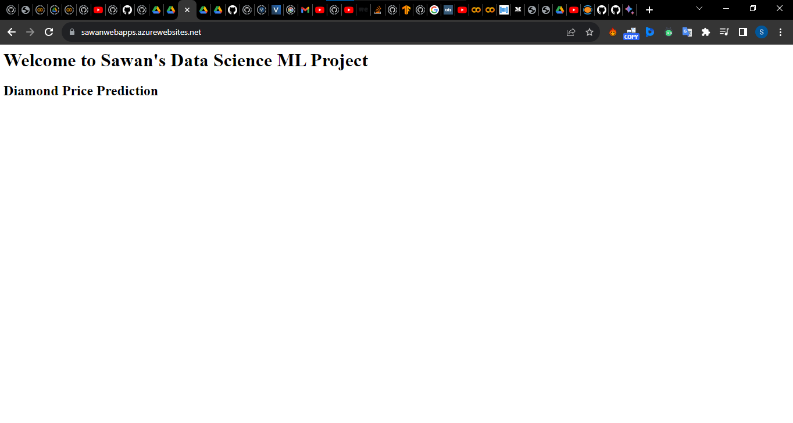
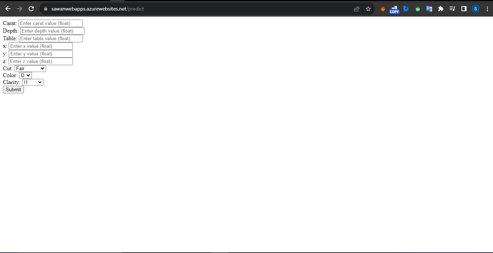
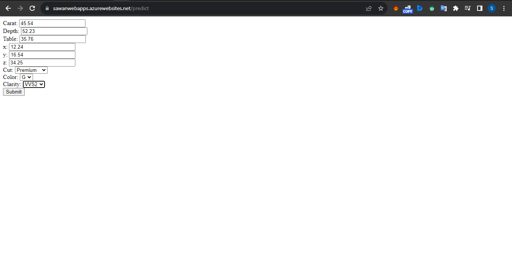
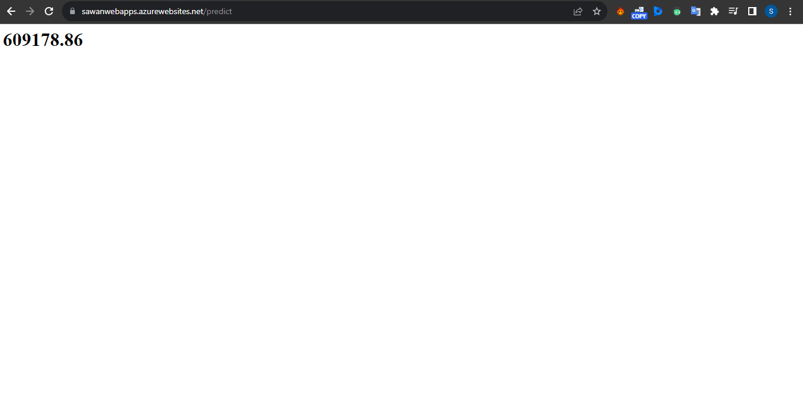

## End to End ML Project House Price

### Created environment
```
conda create -p venv python==3.8

conda activate venv/
or
source activate venv/
```

### Install necessary Libraries
```
pip install -r requirements.txt

python setup.py install ----- if we want to install setup.py file alone
```
### Application deployed in Azure Web Apps

 * Application deployed link: (https://sawanwebapps.azurewebsites.net/)

#### Screenshot of UI










